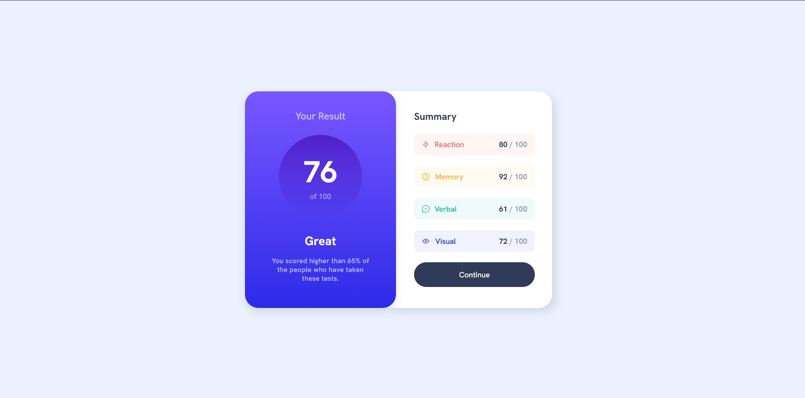

# Frontend Mentor - Results summary component solution

This is a solution to the [Results summary component challenge on Frontend Mentor](https://www.frontendmentor.io/challenges/results-summary-component-CE_K6s0maV). Frontend Mentor challenges help you improve your coding skills by building realistic projects.

## Table of contents

- [Overview](#overview)
  - [The challenge](#the-challenge)
  - [Screenshot](#screenshot)
  - [Links](#links)
- [My process](#my-process)
  - [Built with](#built-with)
  - [What I learned](#what-i-learned)
  - [Continued development](#continued-development)
- [Author](#author)

## Overview

### The challenge

Users should be able to:

- View the optimal layout for the interface depending on their device's screen size
- See hover and focus states for all interactive elements on the page

### Screenshot



### Links

- Solution URL: [Frontend Mentor Solution](https://www.frontendmentor.io/solutions/)
- Live Site URL: [Live Demo](https://your-live-site-url.com)

## My process

### Built with

- Semantic HTML5 markup
- CSS custom properties
- Flexbox
- Mobile-first workflow
- BEM naming convention

### What I learned

I reinforced my knowledge of **mobile-first responsive design** and how to use **flexbox** to create adaptive layouts. I also practiced writing **clean and maintainable CSS** using BEM and custom properties.

```css
.result-summary__item {
  display: flex;
  justify-content: space-between;
  border-radius: 0.6rem;
  padding: 0.8rem 1rem;
}
```

### Continued development

I want to continue improving my accessibility practices (like semantic headings and alt text) and focus more on writing DRY CSS by reusing styles instead of repeating similar rules.

## Author

- Frontend Mentor - @juanfeoru
- GitHub - @juanfeoru
